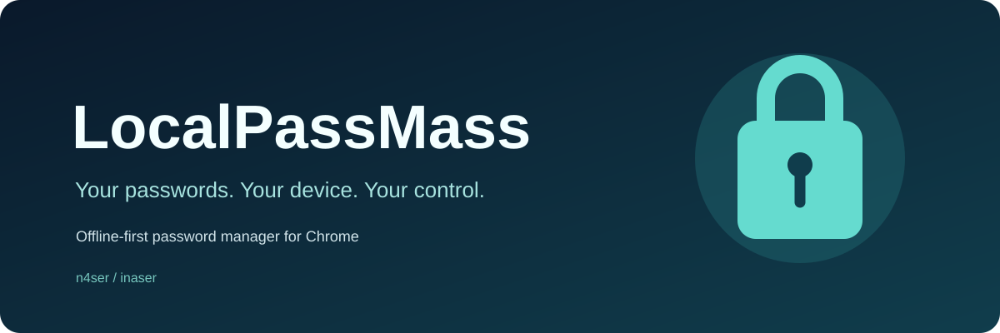
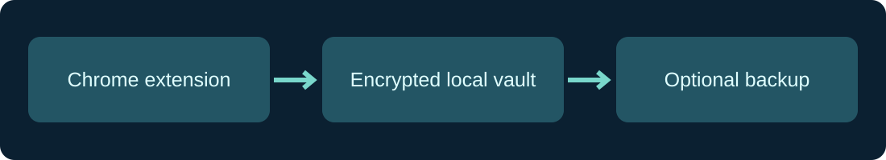

<p align="center">
  
</p>

<p align="center">
  <strong>English</strong> · <a href="README_FA.md">فارسی / Persian</a> · <a href="SECURITY.md">Security</a> · <a href="CONTRIBUTING.md">Contributing</a>
</p>

# LocalPassMass

**Maintained by [n4ser](https://github.com/n4ser) · [inaser](https://inaser.ir)**

**Stop remembering the same passwords for every site.** LocalPassMass helps you save logins, create stronger passwords and fill sign-in forms. Your encrypted vault stays on your computer—not in an account on our servers.

LocalPassMass is a **Manifest V3 Chrome extension**. Its default mode stores an encrypted vault in the current Chrome profile. There is no built-in cloud sync or analytics endpoint for vault data. An optional Windows helper can share a vault across Chrome profiles; it is **not** needed for everyday use.

## At a glance

| Feature | What it does |
| --- | --- |
| 🔐 Local encrypted vault | AES-256-GCM data encryption; master-password and recovery-key unlock paths |
| 🔑 Password generator | Configurable length and character groups, using Web Crypto randomness |
| 🧩 Save & fill | Site-aware sign-in suggestions and optional save prompts after login |
| 🗂️ Account organization | Search, tags, favorites, and password history |
| 📥 Import & backup | Local CSV/JSON import and encrypted `.svault` export |
| 🌗 Languages & appearance | Persian and English UI, with system/light/dark themes |
| 🪟 Optional Windows shared vault | Local Native Messaging helper for multiple Chrome profiles |

<p align="center">
  
</p>

## Quick start (unpacked extension)

1. Download this repository as ZIP, then **extract** it (or clone it).
2. In Chrome, open `chrome://extensions` and turn on **Developer mode**.
3. Select **Load unpacked** and choose the **repository root directory** — the folder containing `manifest.json`.
4. Create a master password. Keep the displayed **Recovery Key** somewhere separate and secure.
5. Follow the first-run checklist to grant **site access** only if you want autofill and in-page save prompts.

> **Updating an existing unpacked installation:** Export a backup first. Keep the existing extension installed and update the files **in the same directory**, then press **Reload** at `chrome://extensions`. Removing and reinstalling an unpacked extension from a different path may change its extension ID and leave the previous profile data inaccessible to that installation.

**Requirements:** Google Chrome 127+ on a supported desktop operating system. The shared-vault helper is Windows-specific. The extension does not require Node.js or a build step to run.

## How it protects your data

- Vault data is encrypted locally using **AES-256-GCM**; the master password is processed with **PBKDF2-SHA256 (600,000 iterations)** to wrap a separate random vault key.
- A separate Recovery Key can unlock the vault if you forget the master password. **Losing both can mean permanent data loss.**
- Unlock material is held in Chrome session storage rather than deliberately persisted as a plaintext vault key on disk.
- Site access and extra browser permissions are requested for the relevant optional features instead of requiring broad access on installation.
- A write-only encrypted inbox supports saving confirmed credentials while the vault is locked; existing passwords cannot be revealed in that state.

**Security boundaries:** This is not a substitute for device security. Malware running as you, a malicious page, or clipboard-reading software may still expose secrets in use. The Windows helper requires separate testing and code signing before broad distribution. This project has **not been independently security-audited**. Read [SECURITY.md](SECURITY.md) for details.

## Permissions, explained

| When | Permissions |
| --- | --- |
| On install | `storage`, `alarms`, `idle`, `activeTab` |
| With explicit opt-in | `scripting` and site access (form integration) |
| Optional features | `nativeMessaging` (Windows shared vault), `offscreen` + `clipboardWrite` (clipboard auto-clear), `favicon` (site icons) |

LocalPassMass does **not** request browser history or cookies permissions. You control which sites can use its form integration.

## Development & verification

No package manager or third-party build dependencies are needed for the extension itself. For repository checks, use **Node.js 22+**:

```bash
node scripts/validate-extension.mjs
node --test tests/*.test.cjs
```

These checks cover package references, JavaScript syntax and focused regressions. They **do not** replace real Chrome interaction tests, backup/restore tests, a security review, or Windows Native Messaging tests. See [the release checklist](docs/RELEASE_CHECKLIST.md).

## Screenshots and documentation

The artwork above is a **conceptual illustration**, not a screenshot of the running UI. For a product demo, capture the actual popup, password generator and first-run flow with dummy credentials. See [the screenshot guide](docs/SCREENSHOTS.md). Additional product documentation: [inaser.ir](https://inaser.ir/documents/LocalPassMass).

## Contribute

Bug reports, reproducible test cases, localization improvements and carefully scoped pull requests are welcome. Please read [CONTRIBUTING.md](CONTRIBUTING.md) and report sensitive security issues privately rather than posting exploit details publicly.

**License:** No license file has been selected for this repository yet. Public source availability does not by itself grant reuse or redistribution rights; please contact the maintainer before reusing the code.

## Free today. Pro is planned.

Everything currently available for saving, filling, recovering and exporting passwords remains free. Pro will introduce additional, clearly identified local features after development and testing. Its purchase information is hosted separately on [inaser.ir](https://inaser.ir/extensions/localpassmass); licensing does not upload your vault or password data. **Please do not purchase an unreleased feature.**

### Pro activation

Pro codes are verified locally with a public signing key. A verified code does not currently unlock features beyond Free; paid Pro functionality is still in development. Do not purchase unreleased features.
